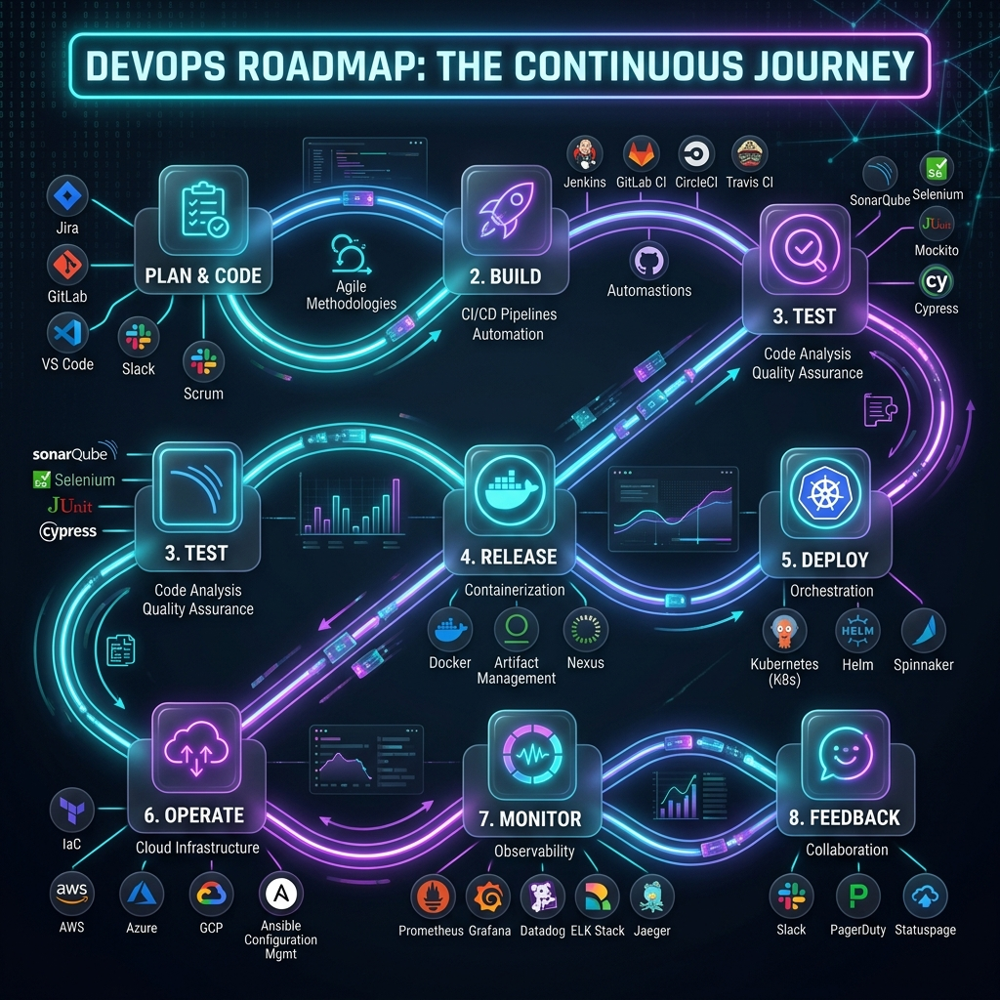

<div align="center">
  <h1>🚀 Master the DevOps Roadmap 2026</h1>
  <p><strong>The Ultimate, Step-by-Step Guide to Becoming a Modern DevOps Engineer</strong></p>
  
  <p>
    
    
    
  </p>
</div>

<br/>

<br/>

<div align="center">
  <h3>🌍 <a href="https://vikramakula-dev.github.io/Master-the-DevOps/">View the Live Roadmap Platform Here</a> 🌍</h3>
  <br/>
  
</div>

<br/>

## 🌟 About the Project

**Master the DevOps Roadmap 2026** is a comprehensive, interactive learning platform designed to guide you from complete beginner to Senior DevOps Engineer. It is not just a list of tools—it's a carefully structured curriculum focusing on **"Why"** before **"How,"** complete with real-time projects, chaos engineering drills, and actual interview Q&A.

This repository holds the source code for the interactive roadmap website, featuring a dynamic UI, progress tracking, and incredibly detailed, module-by-module learning content.

---

## 🗺️ The Roadmap Curriculum

All **20 modules** are live as full learning pages — notes, annotated code, real-time incidents, hands-on projects, and interview Q&A. Click any module to open it:

### Phase 1: The Foundations 🟢
*   **[Module 01](https://vikramakula-dev.github.io/Master-the-DevOps/module-01.html):** Introduction to DevOps (Culture, CALMS, SDLC, CI/CD Concepts, Toolchain)
*   **[Module 02](https://vikramakula-dev.github.io/Master-the-DevOps/module-02.html):** Operating Systems & Linux (CLI, Permissions, Bash Scripting, SSH, Log Analysis)
*   **[Module 03](https://vikramakula-dev.github.io/Master-the-DevOps/module-03.html):** Version Control with Git & GitHub (Branching, Rebase, Workflows, PRs)
*   **[Module 04](https://vikramakula-dev.github.io/Master-the-DevOps/module-04.html):** Networking & Security Fundamentals (OSI, DNS, HTTP/S, TLS, Firewalls, Proxies)
*   **[Module 05](https://vikramakula-dev.github.io/Master-the-DevOps/module-05.html):** Build & Package Manager Tools (Maven, Gradle, npm, pip, Artifacts & Versioning)

### Phase 2: CI/CD & Containers 🟡
*   **[Module 06](https://vikramakula-dev.github.io/Master-the-DevOps/module-06.html):** Artifact Repository Manager — Nexus (Hosted/Proxy/Group Repos, REST API)
*   **[Module 07](https://vikramakula-dev.github.io/Master-the-DevOps/module-07.html):** CI/CD with Jenkins (Jenkinsfile, Multibranch, Shared Libraries, Agents)
*   **[Module 08](https://vikramakula-dev.github.io/Master-the-DevOps/module-08.html):** Containers with Docker (Dockerfile, Networking, Volumes, Compose)
*   **[Module 09](https://vikramakula-dev.github.io/Master-the-DevOps/module-09.html):** CI/CD Pipeline + Docker Integration (ECR, Dynamic Versioning, SSH Deploys, Smoke Tests)

### Phase 3: Cloud & Orchestration 🔴
*   **[Module 10](https://vikramakula-dev.github.io/Master-the-DevOps/module-10.html):** Introduction to Cloud & AWS (IAM, EC2, VPC, S3, ALB, RDS, CloudWatch)
*   **[Module 11](https://vikramakula-dev.github.io/Master-the-DevOps/module-11.html):** Container Orchestration with Kubernetes (Pods, Deployments, Services, Helm, HPA)
*   **[Module 12](https://vikramakula-dev.github.io/Master-the-DevOps/module-12.html):** Kubernetes on AWS — EKS (eksctl, IRSA, ALB Controller, CI/CD → EKS)
*   **[Module 13](https://vikramakula-dev.github.io/Master-the-DevOps/module-13.html):** Infrastructure as Code with Terraform (HCL, State, Modules, EKS via TF)

### Phase 4: Automation & Observability 🚀
*   **[Module 14](https://vikramakula-dev.github.io/Master-the-DevOps/module-14.html):** Programming & Automation with Python (boto3, REST APIs, Automation Suite)
*   **[Module 15](https://vikramakula-dev.github.io/Master-the-DevOps/module-15.html):** Configuration Management with Ansible (Playbooks, Roles, Vault, Dynamic Inventory)
*   **[Module 16](https://vikramakula-dev.github.io/Master-the-DevOps/module-16.html):** Monitoring & Observability (Prometheus, PromQL, Grafana, AlertManager, Loki)

### Phase 5: Pro Level 🏆
*   **[Module 17](https://vikramakula-dev.github.io/Master-the-DevOps/module-17.html):** GitOps with ArgoCD (Pull-based CD, App of Apps, Multi-Env)
*   **[Module 18](https://vikramakula-dev.github.io/Master-the-DevOps/module-18.html):** DevSecOps (SAST/DAST, Trivy, Vault, K8s Security, Supply Chain, OPA)
*   **[Module 19](https://vikramakula-dev.github.io/Master-the-DevOps/module-19.html):** SRE & Platform Engineering (SLOs, Error Budgets, Chaos Engineering, IDPs, FinOps)
*   **[Module 20](https://vikramakula-dev.github.io/Master-the-DevOps/module-20.html):** AI in DevOps & Career Mastery (AIOps, Service Mesh, Portfolio, Interviews, Certs)

### 🏆 Capstone Project
*   **[Production-Grade E-Commerce Platform on AWS EKS](https://vikramakula-dev.github.io/Master-the-DevOps/project1.html)** — the end-to-end platform that every module builds toward: Terraform-provisioned VPC + EKS, Jenkins CI, GitOps deployment with ArgoCD, Prometheus/Grafana/Loki observability, DevSecOps controls, rollback strategy, FinOps, and load testing.

---

## 🛠️ Features of the Platform

*   **Premium UI/UX:** Modern CSS (glassmorphism, glowing gradients, animated particle-network background) without heavy frameworks.
*   **20 Full Module Pages:** Each with a sticky table of contents, annotated code blocks, diagrams, tables, and pro-tip callouts.
*   **Real-World Post-Mortems:** Every tech module includes 🔥 "Real-Time Incidents" (OOM kills, disk-full, leaked secrets, hung deploys) taught as symptom → investigation → root cause → fix → prevention.
*   **Hands-On Projects:** Every module ends with a real-time project walkthrough with complete, copy-paste-ready code.
*   **Interview Preparation:** Expandable Q&A cards with real DevOps interview questions at the end of every module.
*   **Connected Curriculum:** Modules explicitly build on each other (Bash exit codes → pipeline gates → smoke tests → alerts), all converging on the Capstone.

---

## 💻 Tech Stack

*   **Core:** HTML5, CSS3, Vanilla JavaScript
*   **Typography:** [Inter](https://fonts.google.com/specimen/Inter) (UI) & [JetBrains Mono](https://fonts.google.com/specimen/JetBrains+Mono) (Code)
*   **Icons:** Inline SVG Icons (Lucide)
*   **Hosting:** Ready for GitHub Pages / Vercel

---

## 🚀 Getting Started Locally

To run the roadmap platform locally, you simply need a web browser or a basic local server.

```bash
# Clone the repository
git clone https://github.com/vikramakula-dev/Master-the-DevOps.git

# Navigate into the directory
cd Master-the-DevOps

# Serve the files (Requires Node.js/npx or Python)
npx serve .
# OR
python3 -m http.server 8000
```
Open `http://localhost:3000` (or `8000`) in your browser to view the interactive roadmap.

---

<div align="center">
  <p>Built with ❤️ by Vikram Akula.</p>
</div>
